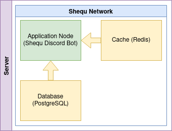

# **Community Discord Bot**

> A discord bot for our community, available to everyone. You can clone this repo and use this bot for your server, you also have the option to offer features on the community branch.

This bot uses the [discord-sucrose](https://www.npmjs.com/package/discord-sucrose) package for its structure

## **# Table of contents**

- [setup](#setup)
  - [development](#setup-for-development)
  - [production](#setup-for-production)
    - [with PM2](#with-pm2)
    - [with docker-compose](#with-docker-compose)

## **# Setup**

A guide on the several ways to start your Discord bot

### **Setup for development**

> Use this method on the machine you are coding on, when you are actively working on your application.
>
> - Install Node.js on your machine
> - Clone Shequ repo and move into it
> - Set your Discord app token in .env file
> - Install all dependencies: `npm install`
> - Start with command: `npm start`

### **Setup for production**

> #### **# With PM2**
>
> PM2 is an NPM package that helps keep your applications online in the background of your server. PM2 is not a good solution, it is recommended to use docker instead.
>
> - Install Node.js on your machine
> - Install PM2 globally with full permissions: `sudo npm i -g pm2`
> - Clone Shequ repo and move into it
> - Set your Discord app token in the .env file
> - Set the NODE_ENV variable with the value 'production'
> - Install all dependencies: `npm install --production=false`
> - Start with command: `pm2 start dist/index.js --name shequ`
> - Stop with command: `pm2 stop shequ`
>
> #### **# With docker-compose**
>
> Docker is the best solution to manage your applications, it allows you to isolate each of your applications in a docker container. So that it does not interfere with the others.
>
>   
> _Each square inside the Network corresponds to a container_
>
> - Install Docker on your machine
> - Install docker-compose plugin in Docker
> - Clone Shequ repo and move into it
> - Set your Discord app token in the .env file
> - Set the NODE_ENV variable with the value 'production'
> - Start with command: `docker compose up -d`
> - Stop with command: `docker compose down`
